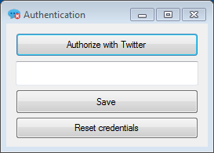
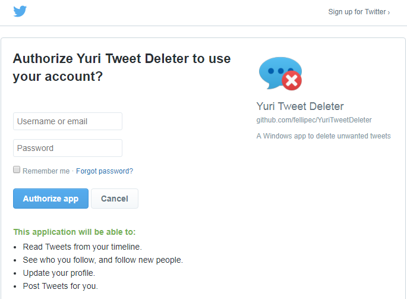
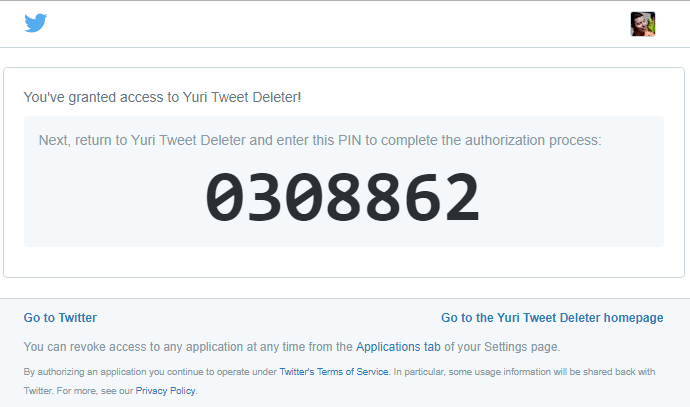
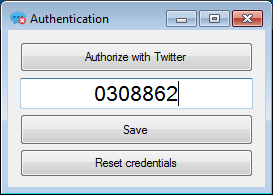

# Authentication with Twitter

In order to be able to delete unwanted tweets, you first need to authorize the program to use your Twitter account. 

The first step is to click on `"Authorize with Twitter"` button.

A browser window will open. You should log in with your Twitter account. 

Once authorized, Twitter will show you a PIN.

Copy or type the number into the text box, then click `Save`.

