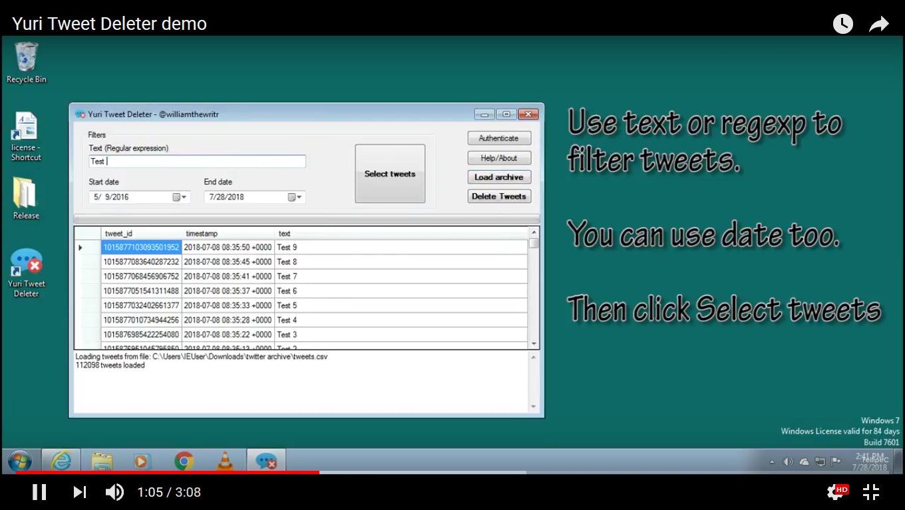
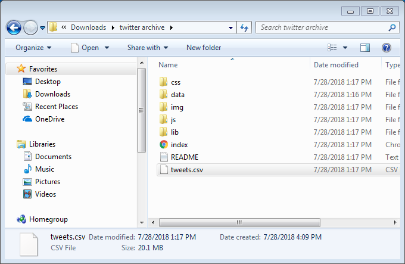
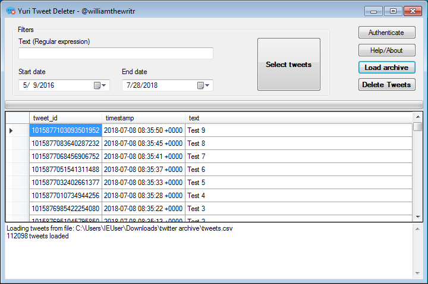
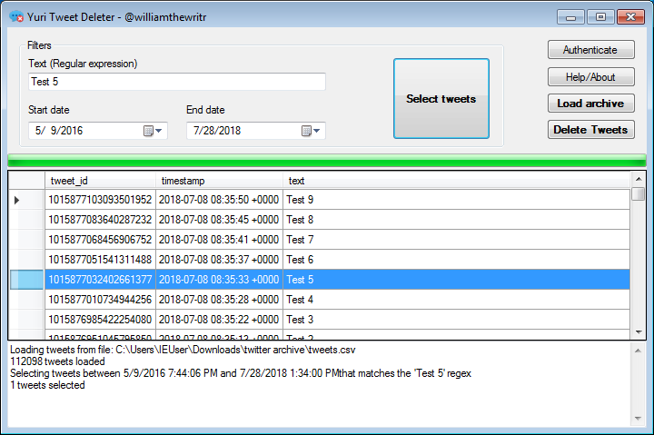

For a number of reasons, you may want to delete old things you tweeted. Doing that manually is a tedious and time-consuming task. This app was created to automate this chore so you can get rid of your unwanted tweets in a fast and convenient way.

# Download

To download the latest version, [check the releases](https://github.com/fellipec/YuriTweetDeleter/releases).

# Video tutorial

# How to use

When opening the application for the first time, you need to authenticate with Twitter. Click on [this link](auth.md) for instructions about that.

You will need to download your Twitter archive. You can request it on [this link](https://twitter.com/settings/account). It may take some time for the Twitter process it.

Once you get the file, unzip it. You will need the file named `tweets.csv`

In the main program window, select the button `Load archive` and open the `tweets.csv` file. The program will start loading it. Depending on the size of your archive this operation can take few minutes.

Once the archive is successfully loaded, the tweets will be displayed in a grid.

You can either select a start and end date and/or type a text filter. The text filter recognizes [regular expressions](regex.md). 

Click on `Select tweets` to automatically select all the tweets matching your search parameters. This may take a few minutes to complete. The selected tweets will be highlighted on the grid.

You can manually select the tweets. Hold `<CTRL>` while clicking to select multiple tweets. When you are satisfied with your selection, click on the button `Delete Tweets`. The program will then issue deletion commands to Twitter. This may take a while to complete. 

## [Authentication help](auth.md)
## [Regular expression help](regex.md)

***

### License information

This program is licensed in the terms of [GPL 3.0](https://www.gnu.org/licenses/gpl-3.0.en.html). The software is provided "as-is" without warranties of any kind.

This software uses the [Tweetinvi Library](https://github.com/linvi/tweetinvi) and the [LumenWorksCSVReader](https://github.com/phatcher/CsvReader)
